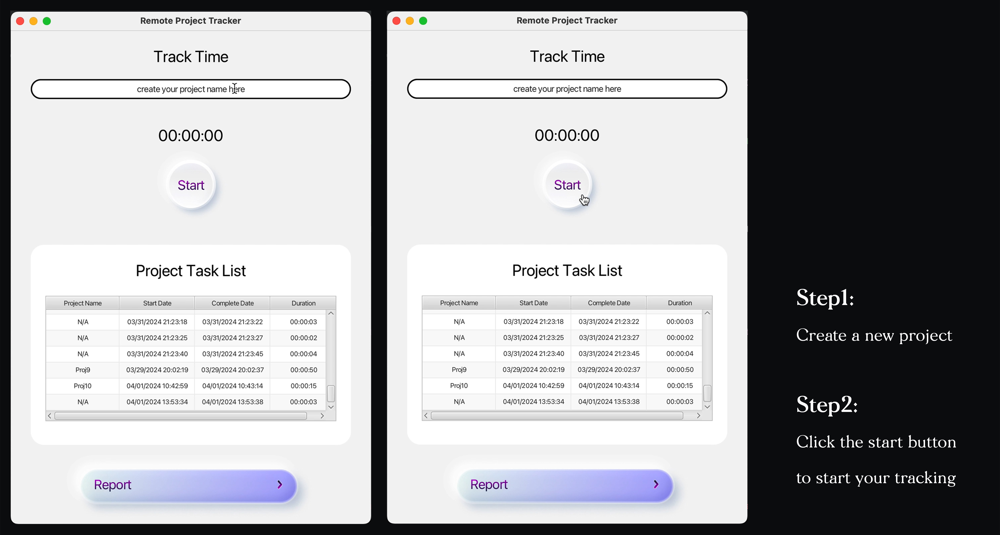
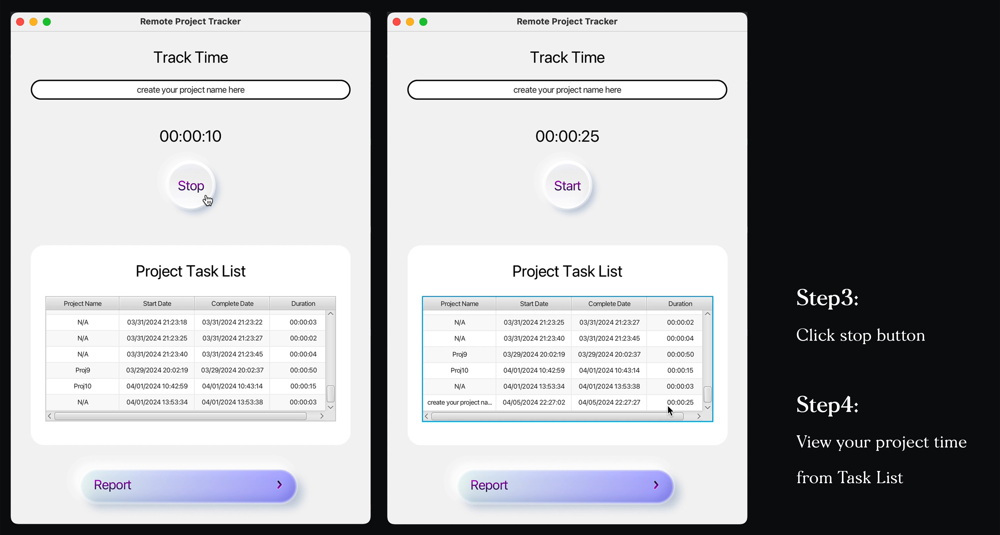
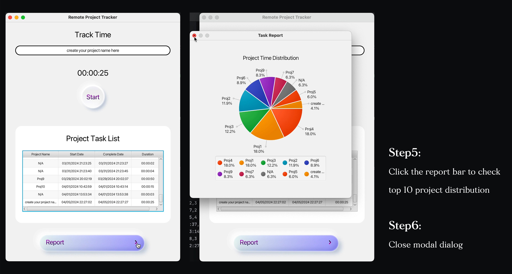

# Remote work project time track app

## General description of the project

This project is a time tracker for tracing remote projects. Users can create their project and track time, and a table list will update and show their project record in real-time, user can also check their record report, which displays the top 10 projects regarding duration times in percentage by pie chart.
The purpose of this project is to create a simple but functional time-tracking application for freelancers or remote workers, they can easily use and record, and find what project they spend most of their time on, empowering them to manage their time effectively.
Screenshots of the user interface.

## Screenshots of the user interface

## Usage instructions for a novice user
### Step1: Run the application
Executing the main method in the ‘TimeTrackApp’ class,
the application window will appear.
### Step2: Tracking time
Enter the name of your project and click the “Start” button to begin tracking time, to stop click the “Stop” button, the recorded time will be saved.
### Step3: Viewing Project Task List
The table displays the list of recorded project tasks, which shows project name, start dates, complete dates and time durations.
### Step4: Viewing generated reports
Click on the arrow on the right corner of the Report bar, a modal dialog will appear and display a pie chart showing the top 10 of your regarding project distribution of times.
Close the report window by clicking the close button.
### Step5: Exiting the application
Click the close button of the application window.
### Note:
If not enter the name and start tracking, the project name will automately display as “N/A”.
If you want to continue tracking the time of previous

## Self-Evaluation of the project
The project achieves the basic function of my plan, simple and usable. The good side of the project from my perspective is the modern and clean UI, I am trying to make the user interface aesthetic and clean so that it can display information intuitively.
Reading and writing files, and aggregating the same project into one to count the total time are the most challenging parts for me, but I also learn new things from the solving process.
In addition, my project can only track one project at the same time, if a user creates another project and wants to track back to the old project, they need to enter the same project name to continue, if the name is different, it will become a new project, so listing multi-project tracking history for users to select and continue directly will be better.
